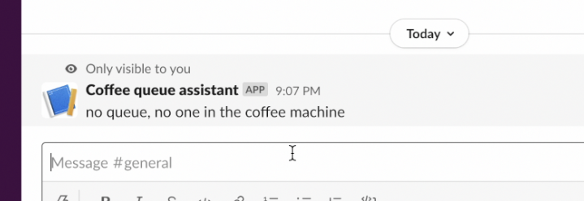
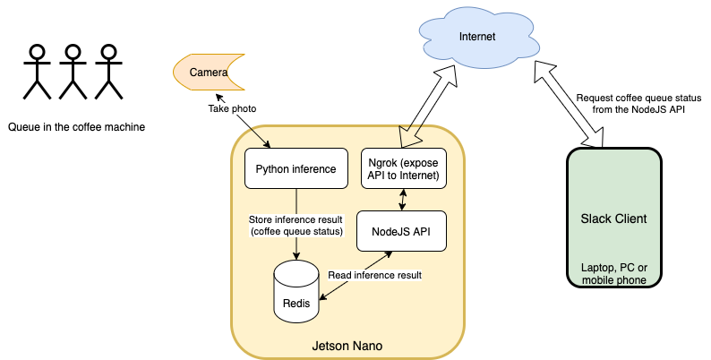
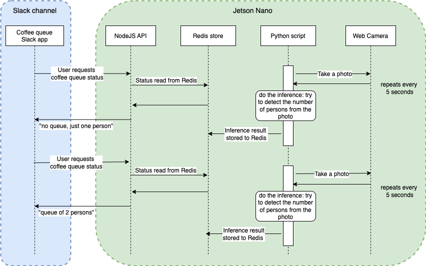

# Coffee queue detector
Tired queueing in the coffee machine? Put the `coffee queue detector` to your Slack channel and Jetson Nano next to your coffee machine. Then just ask the detector if there's queue or not. Or maybe sometimes you would like to hit the queue to have a chat with the people.

## Components

## Runtime

